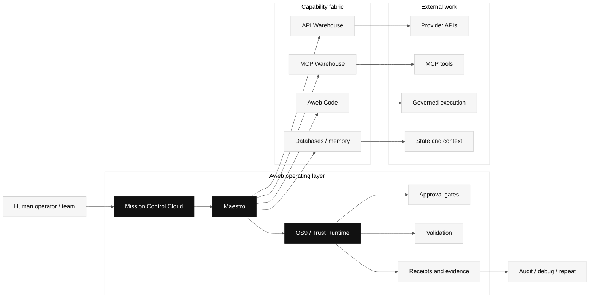
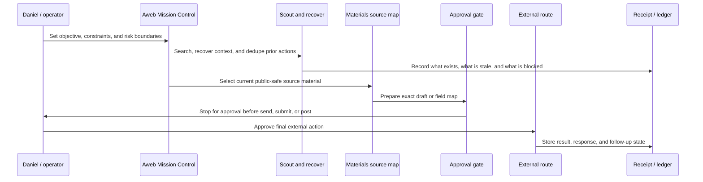
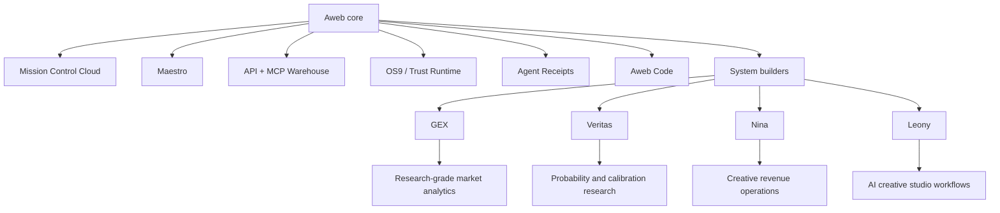

  

<h1 align="center">Aweb Labs Public Proof</h1>

  <strong>Mission Control Cloud for governed AI agent work.</strong>

  <a href="https://aweb-wine.vercel.app/final">Final</a>
  &nbsp;/&nbsp;
  <a href="https://aweb-wine.vercel.app/v2">V2</a>
  &nbsp;/&nbsp;
  <a href="https://aweb-wine.vercel.app/product">Product</a>
  &nbsp;/&nbsp;
  <a href="https://aweb-wine.vercel.app/docs">Docs</a>
  &nbsp;/&nbsp;
  <a href="https://aweb-wine.vercel.app/docs/mcp">MCP</a>
  &nbsp;/&nbsp;
  <a href="https://aweb-wine.vercel.app/docs/api-reference">API</a>
  &nbsp;/&nbsp;
  <a href="./SPEC.md">Spec</a>
  &nbsp;/&nbsp;
  <a href="./COLLABORATION.md">Collaboration</a>

---

Aweb connects AI models, APIs, MCP tools, provider warehouses, databases, governed execution, code validation, approvals, and system builders into auditable AI production workflows.

This repository is the public proof surface for reviewers, investors, collaborators, grant programs, and startup programs. It is deliberately safe: no private source code, credentials, customer data, investor communications, internal logs, application links, legal documents, or wallet instructions.

The short version:

> Let agents do ambitious work. Make the boundary boring, explicit, and inspectable.

## Aweb In One Screen

| Question | Answer |
| --- | --- |
| What is Aweb? | Mission Control Cloud for governed AI agent work. |
| What does it connect? | Models, APIs, MCP tools, provider catalogs, databases, execution environments, approvals, and system builders. |
| What is the product category? | Agentic orchestration, governed execution, AI operations, and control-plane infrastructure. |
| What is the proof? | Aweb is using the same operating loop to run its own communication, application, funding, and material-preparation workflows under Daniel's approval. |
| Who is building it? | Daniel Wahnich, founder/operator, Israel. |
| What is it not? | Not a chatbot wrapper, not a website builder, not a Web3-first pitch, not a trading-profit product. |

## Reviewer Path

| Step | Surface | Why it matters |
| --- | --- | --- |
| 1 | https://aweb-wine.vercel.app/final | Current public positioning, founder proof, live product links. |
| 2 | https://aweb-wine.vercel.app/v2 | Current application surface and operator direction. |
| 3 | https://aweb-wine.vercel.app/product | Product framing for governed agent workflows. |
| 4 | https://aweb-wine.vercel.app/docs | Public docs and architecture entry point. |
| 5 | https://aweb-wine.vercel.app/docs/mcp | MCP/tool integration direction. |
| 6 | https://aweb-wine.vercel.app/docs/api-reference | API-facing platform surface. |
| 7 | https://aweb-wine.vercel.app/api-warehouse/providers | Provider and capability discovery surface. |
| 8 | [SPEC.md](./SPEC.md) | Public control-plane manifest and receipt shape. |

## Control Plane

The model can improvise. The control plane should not.

Aweb's job is to keep agent work routed, bounded, approved, validated, evidenced, and repeatable.

## Operating Loop

This loop is not a demo script. It is how Aweb is operating its own serious workflows.

## Product Surface

Core components:

- **Mission Control Cloud:** the operator surface for governed agent work.
- **Maestro:** orchestration for durable multi-step workflows.
- **API Warehouse:** provider API capability mapping and generated client direction.
- **MCP Warehouse:** tool/provider discovery and adapter surface.
- **OS9 / Trust Runtime:** approvals, policies, boundaries, and evidence.
- **Aweb Code:** validation and governed execution path.
- **System builders:** vertical products and workflow surfaces built on the same substrate.

Vertical proofs:

- **GEX:** research-grade market-structure analytics and risk visibility.
- **Veritas:** probability research, calibration, and decision-support intelligence.
- **Nina:** creative revenue and release-workflow operating system.
- **Leony:** AI creative studio for media, avatar, voice, campaign, and publishing workflows.

Finance-related systems are presented only as research, simulation, risk visibility, and decision support. They are not financial advice, do not imply guaranteed returns, and do not represent autonomous capital deployment.

## Why This Matters

Agents are becoming software operators. They touch APIs, files, browsers, databases, payments, cloud services, docs, customer systems, and generated code. The hard part is no longer "can a model call a tool?"

The hard part is:

- Who authorized this action?
- Which capability was used?
- Which policy applied?
- What context was visible?
- What changed?
- What failed?
- Can a human review it?
- Can the workflow run again without becoming folklore?

Aweb is built for that layer.

## Current Collaboration Fit

Aweb is early, founder-led, and looking for serious conversations with:

- technical angels,
- AI infrastructure investors,
- startup programs,
- grant programs,
- design partners,
- teams already using AI agents in real operations.

See [COLLABORATION.md](./COLLABORATION.md) for public-safe support and partnership routes.

## Language Boundary

Use:

- Mission Control Cloud for governed AI agent work.
- Agentic orchestration platform.
- Operating system for AI production workflows.
- Control plane for agent execution.
- Human-approved sensitive actions.
- Auditable workflows and evidence.
- API Warehouse, MCP Warehouse, Maestro, Trust Runtime, OS9.

Do not use:

- AI founder with no human accountability.
- Guaranteed trading returns.
- Autonomous capital deployment.
- Crypto-first or Web3-first company.
- Alfred-era product language.
- Private investor, email, credential, legal, or wallet information.

## Contact

Daniel Wahnich  
Founder, Aweb  
business@aweb.ai  
https://aweb-wine.vercel.app/final
