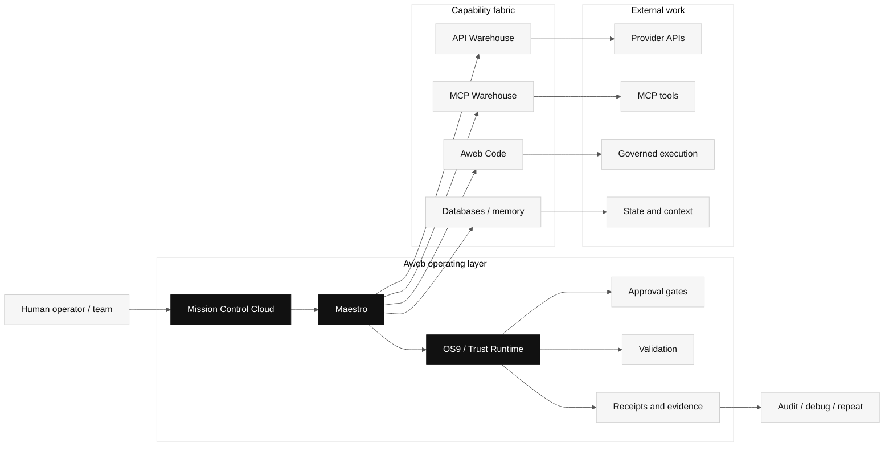
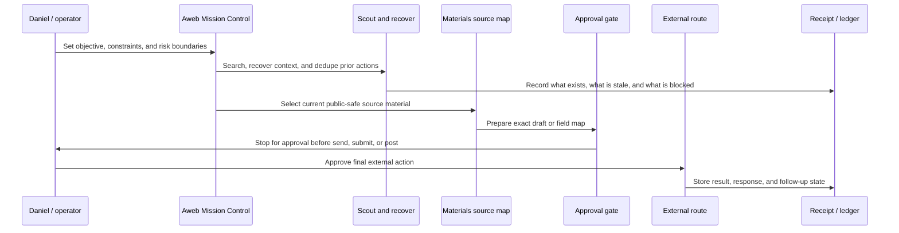
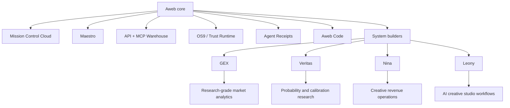

  

<h1 align="center">Aweb Labs Public Proof</h1>

  <strong>Mission Control Cloud for governed AI agent work.</strong>

  <a href="https://aweblabs.ai/final">Final</a>
  &nbsp;/&nbsp;
  <a href="https://aweblabs.ai/v2">V2</a>
  &nbsp;/&nbsp;
  <a href="https://aweblabs.ai/product">Product</a>
  &nbsp;/&nbsp;
  <a href="https://aweblabs.ai/docs">Docs</a>
  &nbsp;/&nbsp;
  <a href="https://aweblabs.ai/docs/mcp">MCP</a>
  &nbsp;/&nbsp;
  <a href="https://aweblabs.ai/docs/api-reference">API</a>
  &nbsp;/&nbsp;
  <a href="https://aweblabs.ai/agent-operations-audit">Audit</a>
  &nbsp;/&nbsp;
  <a href="./REVIEWER_GUIDE.md">Reviewer</a>
  &nbsp;/&nbsp;
  <a href="./SPEC.md">Spec</a>
  &nbsp;/&nbsp;
  <a href="./PILOT.md">Pilot</a>
  &nbsp;/&nbsp;
  <a href="./COLLABORATION.md">Collaboration</a>

---

Aweb connects AI models, APIs, MCP tools, provider warehouses, databases, governed execution, code validation, approvals, and system builders into auditable AI production workflows.

This repository is the public proof surface for reviewers, investors, collaborators, grant programs, and startup programs. It is deliberately safe: no private source code, credentials, customer data, investor communications, internal logs, application links, legal documents, or wallet instructions.

The short version:

> Let agents do ambitious work. Make the boundary boring, explicit, and inspectable.

Canonical web surface: https://aweblabs.ai

Machine-readable proof index: [PUBLIC-PROOF.json](./PUBLIC-PROOF.json)

## Aweb In One Screen

| Question | Answer |
| --- | --- |
| What is Aweb? | Mission Control Cloud for governed AI agent work. |
| What does it connect? | Models, APIs, MCP tools, provider catalogs, databases, execution environments, approvals, and system builders. |
| What is the product category? | Agentic orchestration, governed execution, AI operations, and control-plane infrastructure. |
| What is the proof? | Aweb is using the same operating loop to run its own communication, application, funding, and material-preparation workflows under Daniel's approval. |
| What can a team buy now? | A focused Agent Operations Audit for one agent/tool/API workflow. |
| Who is building it? | Daniel Wahnich, founder/operator, Israel. |
| What is it not? | Not a chatbot wrapper, not a website builder, not a Web3-first pitch, not a trading-profit product. |

## If You Have 10 Minutes

Read this repo in this order:

1. [REVIEWER_GUIDE.md](./REVIEWER_GUIDE.md) for the technical review path.
2. [SPEC.md](./SPEC.md) for the governed run model.
3. [examples/funding-ops-run.manifest.json](./examples/funding-ops-run.manifest.json) for the example manifest.
4. [examples/funding-ops-receipt.redacted.json](./examples/funding-ops-receipt.redacted.json) for the example receipt.
5. https://aweblabs.ai/agent-operations-audit for the narrow commercial entry point.

The key review question is simple: where does the system stop before doing something risky?

## Agentic Operations

Aweb does not hide the operating loop.

The company is dogfooding the same governed-agent pattern it is building: Aweb scouts opportunities, recovers prior communication state, checks duplicate risk, selects current source material, prepares drafts, maps application fields, and blocks external action until Daniel approves.

That matters because resource-seeking is not a side quest for an AI operations company. It is one of the hardest real workflows: incomplete context, high consequences, stale material risk, private data boundaries, public claims, forms, emails, follow-ups, and human accountability.

The point is not "an AI sends things by itself." The point is sharper:

> Aweb turns serious company operations into supervised, auditable agent workflows.

## Reviewer Path

| Step | Surface | Why it matters |
| --- | --- | --- |
| 1 | https://aweblabs.ai/final | Current public positioning, founder proof, live product links. |
| 2 | https://aweblabs.ai/v2 | Current application surface and operator direction. |
| 3 | https://aweblabs.ai/product | Product framing for governed agent workflows. |
| 4 | https://aweblabs.ai/docs | Public docs and architecture entry point. |
| 5 | https://aweblabs.ai/docs/mcp | MCP/tool integration direction. |
| 6 | https://aweblabs.ai/docs/api-reference | API-facing platform surface. |
| 7 | https://aweblabs.ai/api-warehouse/providers | Provider and capability discovery surface. |
| 8 | https://aweblabs.ai/agent-operations-audit | Paid pilot intake for teams using agents against real tools. |
| 9 | [REVIEWER_GUIDE.md](./REVIEWER_GUIDE.md) | Fast technical review path and non-negotiable invariants. |
| 10 | [SPEC.md](./SPEC.md) | Public control-plane manifest and receipt shape. |
| 11 | [PUBLIC-PROOF.json](./PUBLIC-PROOF.json) | Machine-readable index of public surfaces, claims, and boundaries. |

## Infrastructure Support

Aweb has earned early startup-program and infrastructure-credit support from developer-platform ecosystems. This is useful evidence, but it is not presented as customer traction, revenue, endorsement, or investment.

| Provider | Recorded support status | Why it matters to Aweb |
| --- | --- | --- |
| Neon | Credits applied | Postgres data plane for workflows, receipts, state, and operational records. |
| E2B | E2B for Startups accepted | Governed sandbox execution for agent-generated code and replayable runs. |
| Sentry | Sentry for Startups credits approved | Observability for production agent workflows and failure recovery. |
| Mixpanel | Mixpanel for Startups accepted | Product analytics for operator surfaces and workflow usage. |
| Amplitude | Startup Scholarship accepted | Analytics, experimentation, and product insight for Aweb surfaces. |
| MongoDB | Startup-program route recorded | Data, search, and AI application infrastructure route; not claimed here as endorsement. |

No provider listed here is described as an investor, customer, partner, or endorser of Aweb unless a provider explicitly says so in writing.

## Control Plane

The model can improvise. The control plane should not.

Aweb's job is to keep agent work routed, bounded, approved, validated, evidenced, and repeatable.

## Boundary Invariants

| Invariant | What it means |
| --- | --- |
| Default-deny external action | Email, submit, post, payment, legal, credential, and account actions need explicit human approval. |
| No secret leakage | Public proof must not expose credentials, OAuth tokens, private inboxes, legal docs, wallet instructions, or private investor/customer data. |
| Evidence before action | High-consequence workflows need source maps, claim checks, and reviewable context before execution. |
| Receipts after action | Completed, blocked, failed, and rejected runs leave a durable summary of what happened. |
| Honest uncertainty | Missing source material, stale claims, duplicate risk, and incomplete setup should block or downgrade the run. |

## Operating Loop

This loop is not a demo script. It is how Aweb is operating its own serious workflows.

## Product Surface

Core components:

- **Mission Control Cloud:** the operator surface for governed agent work.
- **Maestro:** orchestration for durable multi-step workflows.
- **API Warehouse:** provider API capability mapping and generated client direction.
- **MCP Warehouse:** tool/provider discovery and adapter surface.
- **OS9 / Trust Runtime:** approvals, policies, boundaries, and evidence.
- **Aweb Code:** validation and governed execution path.
- **System builders:** vertical products and workflow surfaces built on the same substrate.

Vertical proofs:

- **GEX:** research-grade market-structure analytics and risk visibility.
- **Veritas:** probability research, calibration, and decision-support intelligence.
- **Nina:** creative revenue and release-workflow operating system.
- **Leony:** AI creative studio for media, avatar, voice, campaign, and publishing workflows.

Finance-related systems are presented only as research, simulation, risk visibility, and decision support. They are not financial advice, do not imply guaranteed returns, and do not represent autonomous capital deployment.

## Why This Matters

Agents are becoming software operators. They touch APIs, files, browsers, databases, payments, cloud services, docs, customer systems, and generated code. The hard part is no longer "can a model call a tool?"

The hard part is:

- Who authorized this action?
- Which capability was used?
- Which policy applied?
- What context was visible?
- What changed?
- What failed?
- Can a human review it?
- Can the workflow run again without becoming folklore?

Aweb is built for that layer.

## Current Collaboration Fit

Aweb is currently strongest for:

- paid Agent Operations Audits,
- technical design partners,
- AI infrastructure investors and accelerators,
- startup programs that care about agentic AI, MCP tools, provider routing, approvals, receipts, and production governance.

Commercial intake:

https://aweblabs.ai/agent-operations-audit

Aweb is early, founder-led, and looking for serious conversations with:

- technical angels,
- AI infrastructure investors,
- startup programs,
- grant programs,
- design partners,
- teams already using AI agents in real operations.

The fastest practical collaboration path is a paid [Aweb Agent Operations Audit](./PILOT.md) for a real agent/tool/API workflow.

See [COLLABORATION.md](./COLLABORATION.md) for public-safe support and partnership routes.

## Public Proof Files

| File | Purpose |
| --- | --- |
| [REVIEWER_GUIDE.md](./REVIEWER_GUIDE.md) | Fast technical review path and evaluation criteria. |
| [PUBLIC-PROOF.json](./PUBLIC-PROOF.json) | Machine-readable public proof index. |
| [SPEC.md](./SPEC.md) | Governed run state machine, manifest, receipt, and boundary classes. |
| [PILOT.md](./PILOT.md) | Paid Agent Operations Audit scope. |
| [COLLABORATION.md](./COLLABORATION.md) | Public-safe support and partnership routes. |

## Language Boundary

Use:

- Mission Control Cloud for governed AI agent work.
- Agentic orchestration platform.
- Operating system for AI production workflows.
- Control plane for agent execution.
- Human-approved sensitive actions.
- Auditable workflows and evidence.
- API Warehouse, MCP Warehouse, Maestro, Trust Runtime, OS9.

Do not use:

- AI founder with no human accountability.
- Guaranteed trading returns.
- Autonomous capital deployment.
- Crypto-first or Web3-first company.
- Alfred-era product language.
- Private investor, email, credential, legal, or wallet information.

## Contact

Daniel Wahnich  
Founder, Aweb  
business@aweblabs.ai
https://aweblabs.ai/final
