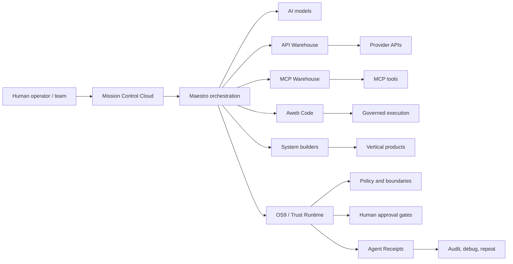
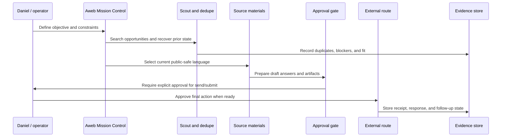
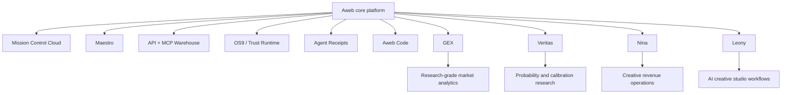

# Aweb Labs Public Proof

**Aweb is Mission Control Cloud for governed AI agent work.**

Aweb connects AI models, APIs, MCP tools, provider warehouses, databases, governed execution, code validation, approvals, and system builders into auditable AI production workflows.

This repository is a public proof surface for reviewers, investors, collaborators, and startup programs. It intentionally contains no private source code, credentials, customer data, investor communications, internal logs, or legal documents.

## Review In Five Minutes

| Layer | Public surface | What to verify |
| --- | --- | --- |
| Company/product | https://aweb-wine.vercel.app/final | Mission Control Cloud, founder-led operation, current Aweb positioning |
| Product page | https://aweb-wine.vercel.app/product | Control plane for governed agent workflows |
| V2 surface | https://aweb-wine.vercel.app/v2 | Current application direction and operator experience |
| Docs | https://aweb-wine.vercel.app/docs | Public developer and architecture materials |
| MCP docs | https://aweb-wine.vercel.app/docs/mcp | Aweb's tool and MCP integration direction |
| API reference | https://aweb-wine.vercel.app/docs/api-reference | API-facing platform surface |
| Providers | https://aweb-wine.vercel.app/docs/providers | Provider and capability model |
| Catalog | https://aweb-wine.vercel.app/api-warehouse/providers | Public provider discovery surface |

## Architecture

Aweb exists because serious agent work needs more than prompts and tool access. It needs a control plane that can discover capabilities, route work through tools and providers, enforce policy, preserve human approval where it matters, and keep evidence of what happened.

## Operating Loop

This operating loop is itself part of the product proof: Aweb is being used to run serious company operations under Daniel's approval, including funding scouts, application maps, communication recovery, and external-action gates.

## Platform Thesis

AI agents are moving from chat into real work: API calls, MCP tools, browsers, databases, cloud services, generated products, email, application workflows, internal operations, and production systems.

Aweb is the operating layer for that shift:

- capability discovery across APIs and MCP tools,
- durable multi-step workflow orchestration,
- governed execution and validation,
- policy, approvals, and operator supervision,
- evidence and receipts for auditability,
- vertical systems built on the same substrate.

## Product Proofs

Core platform:

- **Mission Control Cloud:** operator surface for governed agent work.
- **Maestro:** orchestration layer for durable multi-step workflows.
- **API Warehouse:** provider API capability map and generated client direction.
- **MCP Warehouse:** tool/provider discovery and adapter surface.
- **OS9 / Trust Runtime:** approvals, policy, boundaries, and evidence.
- **Aweb Code:** validation and governed execution path.
- **System builders:** Aweb-generated product and workflow surfaces.

Vertical proof systems:

- **GEX:** research-grade market-structure analytics and risk visibility.
- **Veritas:** probability research, calibration, and decision-support intelligence.
- **Nina:** creative revenue and release-workflow operating system.
- **Leony:** AI creative studio for media, avatar, voice, campaign, and publishing workflows.

Finance-related systems are presented only as research, simulation, risk visibility, and decision support. They are not financial advice, do not imply guaranteed returns, and do not represent autonomous capital deployment.

## Collaboration Posture

Aweb is early, founder-led, and operated by Daniel Wahnich from Israel.

The company is preparing serious conversations with:

- technical angels,
- AI infrastructure investors,
- startup programs,
- grant programs,
- design partners,
- teams that need governed AI workflows rather than another chatbot.

Public materials intentionally avoid:

- Web3-first framing,
- trading-profit claims,
- stale Alfred-era copy,
- chatbot-only framing,
- website-builder-only framing,
- public investment terms,
- private emails, credentials, logs, or investor details.

## Language Boundary

Use this:

- Mission Control Cloud for governed AI agent work.
- Agentic orchestration platform.
- Operating system for AI production workflows.
- Control plane for agent execution.
- Human-approved sensitive actions.
- Auditable workflows and evidence.
- API Warehouse, MCP Warehouse, Maestro, Trust Runtime, OS9.

Do not use this:

- AI founder with no human accountability.
- Guaranteed trading returns.
- Autonomous capital deployment.
- Crypto-first or Web3-first company.
- Alfred-era product language.
- Private investor, email, credential, or legal information.

## Contact

Daniel Wahnich  
Founder, Aweb  
business@aweb.ai  
https://aweb-wine.vercel.app/final
