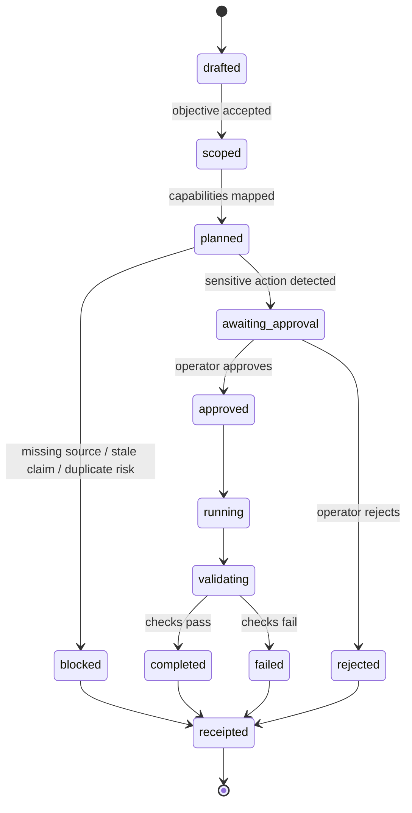

# Aweb Public Control Plane Spec

Draft public proof, v0.1.

This is a public-safe technical sketch of how Aweb thinks about governed agent work. It is not the private Aweb implementation, not an API stability promise, and not a legal or security certification.

## Problem

Modern agents can call tools, APIs, browsers, databases, and execution environments. That makes them useful. It also makes them operationally dangerous when the surrounding control plane is vague.

Aweb treats every serious agent workflow as a governed run:

```text
intent -> capability map -> policy -> plan -> approval -> execution -> receipt
```

The goal is not to make agents timid. The goal is to make their boundaries explicit enough that ambitious work can be trusted, reviewed, repeated, and stopped.

## Governed Run State Machine



## Manifest Shape

```json
{
  "schema": "aweb.governed_run_manifest.v0",
  "run_id": "run_public_example_001",
  "objective": "Prepare a public-safe funding application draft",
  "operator": {
    "name": "Daniel Wahnich",
    "role": "founder_operator"
  },
  "risk_tier": "external_action_gated",
  "source_policy": {
    "current_materials_only": true,
    "no_private_data": true,
    "no_stale_positioning": true,
    "no_unverified_claims": true
  },
  "capabilities": [
    {
      "name": "workspace_search",
      "purpose": "Recover prior outreach and material state",
      "access": "local_read"
    },
    {
      "name": "web_research",
      "purpose": "Verify current external opportunity facts",
      "access": "public_web"
    },
    {
      "name": "draft_generation",
      "purpose": "Prepare field-level answers",
      "access": "local_write"
    }
  ],
  "approval_gates": [
    {
      "action": "send_email",
      "requires_human_approval": true
    },
    {
      "action": "submit_application",
      "requires_human_approval": true
    },
    {
      "action": "post_public_social",
      "requires_human_approval": true
    }
  ],
  "evidence": {
    "expected_outputs": [
      "field_map",
      "draft_package",
      "source_map",
      "final_receipt"
    ]
  }
}
```

## Receipt Shape

```json
{
  "schema": "aweb.agent_receipt.v0",
  "run_id": "run_public_example_001",
  "status": "completed",
  "operator_approval": {
    "required": true,
    "granted": false,
    "reason": "Draft prepared; external submission not approved in this receipt."
  },
  "actions": [
    {
      "type": "read",
      "target": "local_public_materials",
      "result": "source_map_recovered"
    },
    {
      "type": "verify",
      "target": "official_program_sources",
      "result": "current_facts_recorded"
    },
    {
      "type": "write",
      "target": "draft_application_package",
      "result": "created"
    }
  ],
  "blocked_actions": [
    {
      "type": "submit_application",
      "reason": "External action requires Daniel approval."
    }
  ],
  "public_safety": {
    "private_email_exposed": false,
    "credentials_exposed": false,
    "wallet_exposed": false,
    "unverified_claims_added": false
  }
}
```

## Boundary Classes

| Class | Meaning | Default behavior |
| --- | --- | --- |
| `read_only` | Read public or approved local context. | Allowed with receipt. |
| `local_write` | Create drafts, maps, internal docs, or public-safe artifacts. | Allowed with receipt. |
| `external_action_gated` | Email, submit, post, payment, legal, or account actions. | Requires explicit human approval. |
| `secret_gated` | Credentials, OAuth, private inboxes, wallet instructions, legal docs. | Never exposed publicly; use only in approved context. |
| `claim_gated` | Revenue, users, funding, incorporation, customers, performance. | Must be verified or omitted. |

## Public Examples

- [examples/funding-ops-run.manifest.json](./examples/funding-ops-run.manifest.json)
- [examples/funding-ops-receipt.redacted.json](./examples/funding-ops-receipt.redacted.json)

## Engineering Bias

Aweb assumes the model will be powerful, fallible, useful, and occasionally overconfident. The system around it should be:

- typed where possible,
- explicit about risk,
- honest about missing information,
- conservative around external action,
- precise about evidence,
- boring at the boundary.

That is the product.
